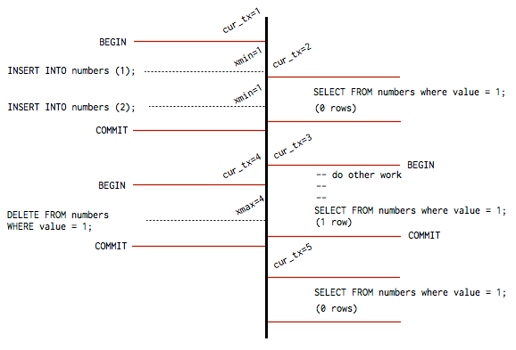

# Internals of Postgres
##  Multi Version Concurrency Control and Transactions
### Chun Li
<!-- Disclaimer: Chun is not a database expert. I just like to read things and pretend I'm smart. -->

---
# Agenda
* MVCC and how Postgres handles transactions
* How is it implemented?
* Extras in between

---
# In the beginning there was nothing...
<!-- Imagine you had to write a database. A simple one would just be a program, reading and writing to a single file; and life is good until suddenly you have more than one client. -->
<!-- This is a pretty classic concurrency problem and Postgres has a elegant and simple solution called MVCC -->
* Imagine a simple database reading and writing to a single file
* Life is good until...


---
# What do we do?
<!-- As you can imagine, these solutions are not the greatest for performance as they bottleneck how fast your database can be. -->
There are a few solutions to this: 
* A global read-write lock on every table
* A single control flow point so execution happens one by one

---
# Let there be light
<!-- Note single statements can also be a transaction. -->
Postgres has an efficient and elegant solution called MVCC:
* Every transaction has a `XID` <!-- transaction ID, from 3 -> 2^31-1 -->
* When you update a row, instead of changing the row create a new version
* This allows all transactions to see a consistent `snapshot`
* Rows keep track of `xmin` and `xmax`
	* Commited rows are only visible to transactions with `xmin < XID < xmax` 

---

Note you can access xmin and xmax as hidden columns, as well as the current XID easily

```SELECT *, xmin, xmax FROM numbers;```
```SELECT txid_current();```

---
# Two updates at the same time
<!-- There is one more concurrent case: what if two transactions try to update a row at the same time? -->
`READ COMMITTED` - By default, Postgres just reruns if the row has commited
`SERIALIZABLE` - Just fail and let the application handle it


---
# But wait, there's more!
<!-- The one glaring problem with MVCC we haven't addressed: what do we do with the old rows? -->
<!-- One way to deal with this problem is to occasionally "garbage collect" and delete the old rows that
are no longer visible to any transactions. This is the approach Postgres takes via the VACUUM process. -->
<!-- Note that AUTO VACUUM is actually not a stop-the-world approach - it can be run in parallel and in fact
DOES. More on this later in EXTRAS -->
<!-- Data part and undo log: data part for current snapshot, undo log to recreate older versions of data. The
downside is when there are update-intensive loads you can run out of space and then it's sad times. -->
What about the old rows? Eventually they are no longer needed.
* Stop-the-world and "vacuum" them up
* This is not the only approach but it's the one Postgres uses

---
# Extras: Postgres `VACUUM`
Especially given write-heavy loads, you may consider tuning your auto-vacuum settings
* ex. Running `VACUUM` at night during low traffic

There are two main vacuums: standard `VACUUM` and `VACUUM FULL`
* `VACUUM` can usually run in parallel with production operations <!-- standard vacuum does create a large amount of I/O traffic so you may see performance drop -->
	* `SELECT`, `INSERT`, `DELETE` <!-- Although ALTER TABLE won't work -->
* `VACUUM FULL` can reclaim more space, but requires an exclusive lock on the table.

The autovacuum daemon only runs `VACUUM` dynamically in response to update activity, to try and maintain a steady usage of disk space <!-- a spike in update activity can force you to have to later run VACUUM FULL if you disable the daemon -->

Running VACUUM yourself is usually NOT a great idea (see Sentry later) unless you have a predictable load

---
# How is it implemented?
<!-- OK HERE IS THE BASIC MACHINARY -->
<!-- Every transaction carries a XID -->
<!-- Note we also keep an xmin (smallest XID of any running transactions when this starts).
This is just to help vacuum keep track of the minimum boundary of data it needs to keep by
taking the min of the xmin of all active transactions. -->
```c
// proc.h
typedef struct PGXACT
{
	TransactionId xid;			
    /* id of top-level transaction currently being
     * executed by this proc, if running and XID
     * is assigned; else InvalidTransactionId */

	TransactionId xmin;
    /* minimal running XID as it was when we were
	 * starting our xact, excluding LAZY VACUUM:
	 * vacuum must not remove tuples deleted by
	 * xid >= xmin ! */

	uint8		vacuumFlags;	
    /* vacuum-related flags, see above */
	...
} PGXACT;
```

---
# How is it implemented?
<!-- In postgres, actual rows (tuple) are stored in the "heap", which are often referred to by indexes via
their tid. Lookup structures like B-Trees will often just store the tid, which is then used to scan the heap
for the actual data. -->
```c
// htup_details.h
/* referenced by HeapTupleHeaderData */
typedef struct HeapTupleFields
{
    TransactionId t_xmin;        
    /* inserting xact ID */
    TransactionId t_xmax;        
    /* deleting or locking xact ID */
    ...
} HeapTupleFields;
```

---
# How is it implemented?


---
<!-- xmin and max are similar as because, but in the opposite way. This represents a snapshot of the db at a point in time. -->
<!-- xmin is calculated the same way as a transactions XID but for a different purpose:
it is a lower boundary for data visibility. -->
<!-- xmax is the last commited xid + 1. -->
<!-- But, we also need the list of all in-flight transactions when this transaction was created.
This is stored in xip (xcnt is just how many there are -->
```c
// snapshot.h
typedef struct SnapshotData
{
    /* ...
     * An MVCC snapshot can never see the effects of 
     * XIDs >= xmax. It can see the effects of all older
     * XIDs except those listed in the snapshot. xmin is
     * stored as an optimization to avoid needing to
     * search the XID arrays for most tuples.
     */
    TransactionId xmin;            
    /* all XID < xmin are visible to me */
    TransactionId xmax;            
    /* all XID >= xmax are invisible to me */

    /*
     * For normal MVCC snapshot this contains the all 
     * xact IDs that are in progress, unless the snapshot
     * was taken during recovery in which case it's empty. 
     * ...
     * note: all ids in xip[] satisfy xmin <= xip[i] < xmax
     */
    TransactionId *xip;
    uint32        xcnt; /* # of xact ids in xip[] */
    ...
}
```
---
# How is it implemented?
<!-- now...how does postgres actually work? -->
<!-- here's the flow for a simple SELECT 1 query. -->
<!-- in postgres, even simple queries are run in a transaction -->
<!-- But postgres is smart: it won't actually assign a xid until you start modifying data,
and it won't give you a snapshot until you at least run your first query. -->

```c
// postgres.c
static void
exec_simple_query(const char *query_string)
{
    ...
    /*
     * Set up a snapshot if parse analysis/planning
     * will need one.
     */
    if (analyze_requires_snapshot(parsetree))
    {
        PushActiveSnapshot(GetTransactionSnapshot());
        snapshot_set = true;
    }
    ...
}
```

---
# How is it implemented?
<!-- nothing really new here, just looking at what i've already said about the fields before. -->
<!-- Note that transaction ids are uint32. It's not as simple as it seems, as you have to deal
with wraparound so you can reuse xids. -->
```c
Snapshot
GetSnapshotData(Snapshot snapshot)
{
    /* xmax is always latestCompletedXid + 1 */
    xmax = ShmemVariableCache->latestCompletedXid;
    Assert(TransactionIdIsNormal(xmax));
    TransactionIdAdvance(xmax);

    ...

    snapshot->xmax = xmax;
}
```

---
# How is it implemented?
<!-- Sentry actually had a problem with this where a write heavy load caused a problem with too many XIDs -->
<!-- Postgres has a VACUUM-FOR-WRAPAROUND process which it tries to run (at around 1B xids) to set the proper XIDs to FrozenXID. This is usually not a problem, UNLESS you mess with your
vacuum settings, in which case you have to be careful. Sentry ended up with a problem where
they didn't run the WRAPAROUND vacuum in time and had to run in read only mode to catch up on vacuuming, or accept data loss. -->
```c
#define InvalidTransactionId        ((TransactionId) 0)
#define BootstrapTransactionId      ((TransactionId) 1)
#define FrozenTransactionId         ((TransactionId) 2)
#define FirstNormalTransactionId    ((TransactionId) 3)
...
/* advance a transaction ID variable,
handling wraparound correctly */
#define TransactionIdAdvance(dest)    \
    do { \
        (dest)++; \
        if ((dest) < FirstNormalTransactionId) \
            (dest) = FirstNormalTransactionId; \
    } while(0)
```
Note this doesn't show how Postgres solves the problem with `XID` wrapping:
* https://www.postgresql.org/docs/9.3/static/routine-vacuuming.html#VACUUM-FOR-WRAPAROUND 
* https://blog.sentry.io/2015/07/23/transaction-id-wraparound-in-postgres.html

---
<!-- Grab xmin and xip for the snapshot -->
<!-- xmin is minimal xid for all running transactions -->
```c
for (index = 0; index < numProcs; index++)
{
    volatile PGXACT *pgxact = &allPgXact[pgprocno];
    TransactionId xid;
    xid = pgxact->xmin; /* fetch just once */

    /*
     * If the transaction has no XID assigned, we can
     * skip it; it won't have sub-XIDs either.  If 
     * the XID is >= xmax, we can also skip it; such
     * transactions will be treated as running anyway
     * (and any sub-XIDs will also be >= xmax).
     */
    if (!TransactionIdIsNormal(xid)
        || !NormalTransactionIdPrecedes(xid, xmax))
        continue;

    if (NormalTransactionIdPrecedes(xid, xmin))
        xmin = xid;

    /* Add XID to snapshot. */
    snapshot->xip[count++] = xid;
    ...
}
...
snapshot->xmin = xmin;
```

---
# How is it implemented?
<!-- Commiting a transaction -->
<!-- in RecordTransactionCommit we write to the WAL, and the clog, which summarizes every transaction (unless it wasn't assigned an XID) and it's status -->
<!-- Writing to WAL is relatively straight forward, but i'm not an expert on db durability so there's not much to say here -->
<!-- Writing a transaction to clog is a bit complicated, as postgres implements subcommits, which can be recorded as commited but are not actually commited until the parent commit has commited. This is in the name of atomicity. -->
```c
static void
CommitTransaction(void)
{
    ...
    /*
     * We need to mark our XIDs as committed in pg_xact.
     * This is where we durably commit.
     */
    latestXid = RecordTransactionCommit();

    /*
     * Let others know about no transaction in progress
     * by me. Note that this must be done _before_
     * releasing locks we hold and _after_ 
     * RecordTransactionCommit.
     */
    ProcArrayEndTransaction(MyProc, latestXid);

    ...
}
```

---
<!-- Once you've commited, tell everyone your ending your transaction -->
# How is it implemented?
```c
void
ProcArrayEndTransaction(PGPROC *proc, 
TransactionId latestXid)
{
    /*
     * We must lock ProcArrayLock while clearing our
     * advertised XID, so that we do not exit the set
     * of "running" transactions while someone else
     * is taking a snapshot.  See discussion in 
     * src/backend/access/transam/README.
     */
    if (LWLockConditionalAcquire(ProcArrayLock, LW_EXCLUSIVE))
    {
        ProcArrayEndTransactionInternal(proc, pgxact, latestXid);
        LWLockRelease(ProcArrayLock);
    }
    ...
}
```

---
# How is it implemented?
```
static inline void
ProcArrayEndTransactionInternal
(PGPROC *proc, PGXACT *pgxact, TransactionId latestXid)
{
    ...
    /* Also advance global latestCompletedXid while
       holding the lock */
    if (TransactionIdPrecedes
    	(ShmemVariableCache->latestCompletedXid,
                              latestXid))
        ShmemVariableCache->latestCompletedXid 
        	= latestXid;
}
```
---
# Proc Array
* Postgres is unique in that it creates a new process for each connection
* Usually it's happy to let them do things in parallel, but transactions commit and abort serially

---
How do we scan for tuples visible to a snapshot?
```c
static void
heapgettup(HeapScanDesc scan, ScanDirection dir,
           int nkeys, ScanKey key) {
    ...
    /*
     * advance the scan until we find a qualifying tuple
     * or run out of stuff to scan
     */
    lpp = PageGetItemId(dp, lineoff);
    for (;;) {
        /*
         * if current tuple qualifies, return it.
         */
        valid = 
        HeapTupleSatisfiesVisibility(tuple, snapshot,
                                     scan->rs_cbuf);
        if (valid) {
            return;
        }
        ++lpp;/* move forward in this page's ItemId array */
        ++lineoff;
    }
    ...
}
```
---
Called by `HeapTupleSatisfiesVisibility`
```c
bool
HeapTupleSatisfiesMVCC(HeapTuple htup, Snapshot snapshot,
                       Buffer buffer) {
    ...
    else if (XidInMVCCSnapshot(
    	HeapTupleHeaderGetRawXmin(tuple), snapshot))
        return false;
    else if (TransactionIdDidCommit(
    	HeapTupleHeaderGetRawXmin(tuple)))
        SetHintBits(tuple, buffer, HEAP_XMIN_COMMITTED,
                    HeapTupleHeaderGetRawXmin(tuple));
    ...

    return false;
}
```
---
<!-- Note you might mistaken the return values as inverted: xid < xmin means it's not in progress
hence is visible -->
<!-- This method checks if the xid is in the snapshot (if xid < xmin and not if out of max, or in progress) -->
<!-- Deep dive into code later if you really want to figure this out -->
```c
static bool
XidInMVCCSnapshot(TransactionId xid, Snapshot snapshot)
{
    /* Any xid < xmin is not in-progress */
    if (TransactionIdPrecedes(xid, snapshot->xmin))
        return false;
    /* Any xid >= xmax is in-progress */
    if (TransactionIdFollowsOrEquals(xid, snapshot->xmax))
        return true;

    ...

    for (i = 0; i < snapshot->xcnt; i++)
    {
        if (TransactionIdEquals(xid, snapshot->xip[i]))
            return true;
    }

    ...
}
```
---
# How is it implemented?
The last thing it does it check if the tuple has commited via the commit log
```c
bool /* true if given transaction committed */
TransactionIdDidCommit(TransactionId transactionId)
{
    XidStatus xidstatus;

    xidstatus = TransactionLogFetch(transactionId);

    /*
     * If it's marked committed, it's committed.
     */
    if (xidstatus == TRANSACTION_STATUS_COMMITTED)
        return true;
    ...
}
```

---
# The End
* I have really only glossed over the surface of Postgres's internals
* It really makes me appreciate the hard work and complexity of a system that is performant, robust and stable
* `TODO`: How does Postgres commit? (durability, the WAL<!-- write ahead log -->, and subcommits)

---
# References
https://brandur.org/postgres-atomicity
https://github.com/postgres/postgres
https://devcenter.heroku.com/articles/postgresql-concurrency
https://www.postgresql.org/docs/9.1/static/routine-vacuuming.html